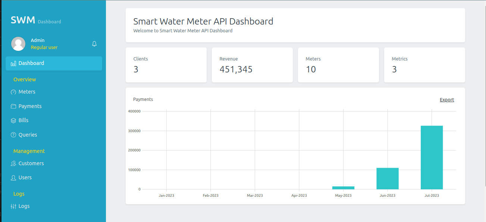

# Smart Water Meter Admin

This contains code for Smart Water Meter Admin Dashboard that will be used together with the application to serve smart water meters.

## Table of Contents
- [Prerequisites](#prerequisites)
- [Installation](#installation)
- [Additional Configuration](#additional-configuration)

<!-- Embed screenshot that's in a public folder in the source codes -->


## Prerequisites
- PHP (version 7.4 or higher)
- Composer
- MySQL

## Installation

### Step 1: Working with source codes

Unzip the contents of your file into a desired folder


### Step 2: Install dependencies

Navigate to the project directory and install the project dependencies by running the following command:

```composer install```


### Step 3: Create a copy of the .env file

Create a copy of the `.env.example` file and name it `.env`. You can use the following command:

```cp .env.example .env```


### Step 4: Generate the application key

Generate the application key by running the following command:

```php artisan key:generate```


### Step 5: Configure the database

Open the `.env` file and update the following lines with your database credentials:

```
DB_DATABASE=your_database_name
DB_USERNAME=your_username
DB_PASSWORD=your_password
```


### Step 6: Run database migrations

Run the database migrations to create the necessary tables:

```php artisan migrate```

### Step 7: Create Orchid Application

Run the following commands to create the Orchid Admin Panel

```php artisan orchid:admin Admin admin@admin.com 12345678```


### Step 8: Start the development server

You can start the development server by running the following command:

```php artisan serve```


The application will be accessible at `http://localhost:8000` in your web browser.

## Additional Configuration

Install Laravel Passport (for API authentication tokens) using the following command:

```php artisan passport:install```
